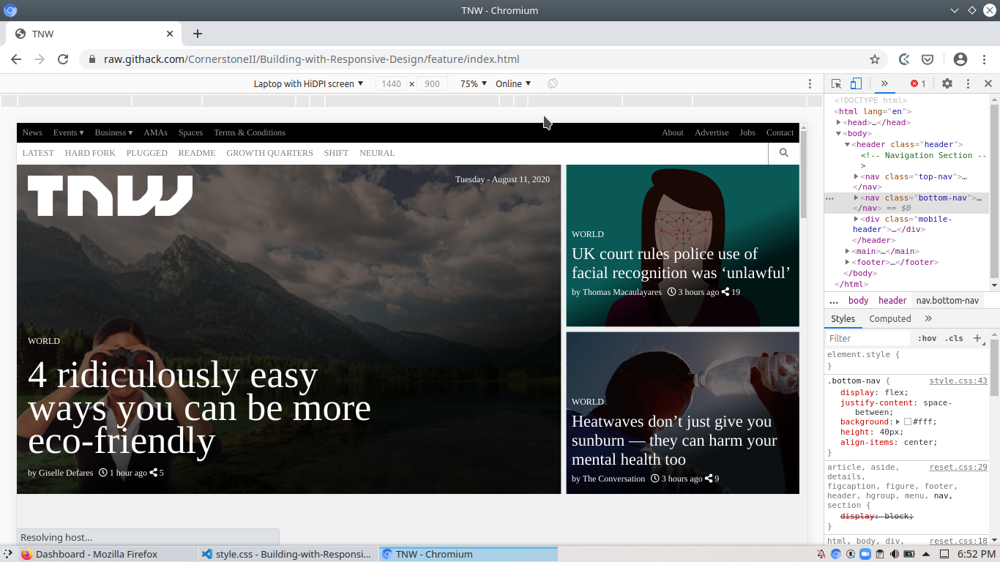
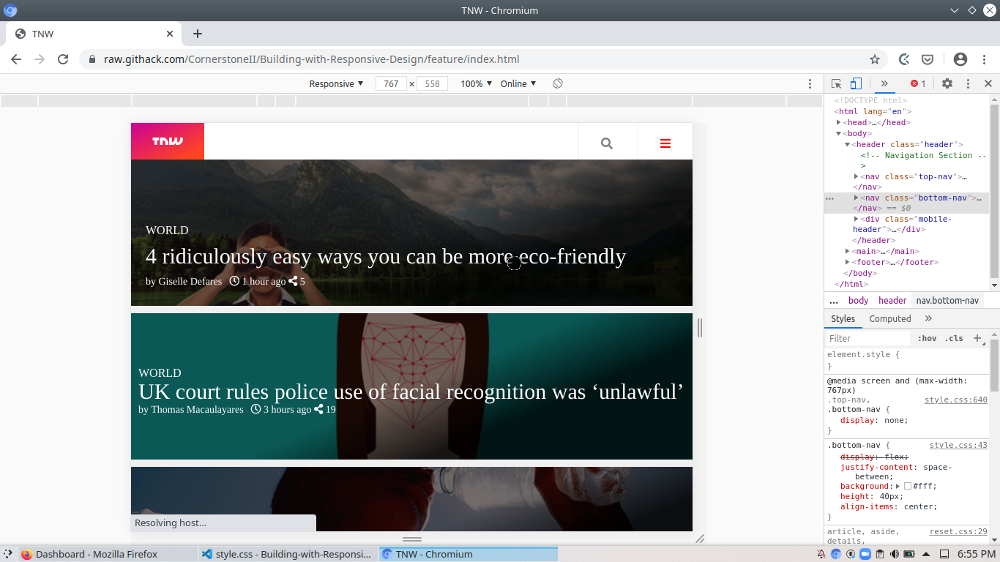
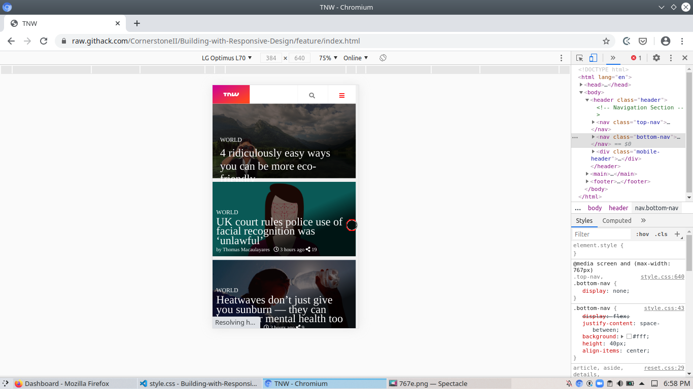

# Building-with-Responsive-Design

This project focuses on reponsiveness to ensure great experience for mobile users. This project is based on The Odin Project and Microverse peer programming collaborative coding. You can find the original project specification at: https://www.theodinproject.com/courses/html5-and-css3/lessons/building-with-responsive-design

## Desktop
 1440px view.

## Tablet
 767px view.

## Mobile
 384px view.

## Built With

- HTML5
- CSS3
- Google Fonts
- Font awesome

## Live Demo

[Live Demo Link](https://raw.githack.com/CornerstoneII/Building-with-Responsive-Design/feature/index.html)

## Prerequisites
Web browser and access to internet

## Getting Started

**To get your own copy of our project clone the repository to your local machine.**

## Authors

👤 **Oluwaseun Iyadi**

- Github: [@CornerstoneII](https://github.com/CornerstoneII)
- Twitter: [@It_Iz_I](https://twitter.com/It_Iz_I)
- Linkedin: [Oluwaseun Iyadi](https://www.linkedin.com/in/oluwaseun-iyadi-773584b4/)

👤 **Nkiruka Oguadinma**

- Github: [@enkog](https://github.com/enkog)
- Twitter: [@enkodes](https://twitter.com/enkodes)

## 🤝 Contributing

Contributions, issues and feature requests are welcome!

Feel free to check the issues page.

## Show your support
Give a ⭐️ if you like this project!

## Acknowledgments
Microverse for showing the way for this project to happen

## 📝 License
This project is MIT licensed.